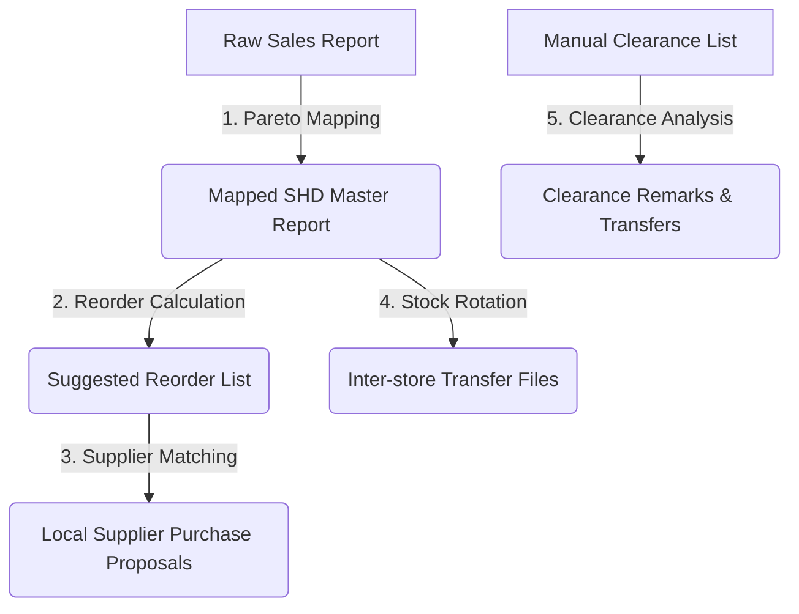

# 🛠️ Workplace Skills Repository

Welcome to the **Workplace Skills** repository! This repository is a centralized, production-grade library of custom automation scripts and agentic skills designed to optimize inventory replenishment, stock balancing, regional supplier mapping, and sales performance analysis.

These skills are structured to be executed seamlessly by both developers and AI agent assistants, utilizing high-performance data processing frameworks (`pandas`, `calamine`, `openpyxl`, `xlsxwriter`) to manipulate complex multi-sheet Excel files.

---

## 📋 Directory of Available Skills

This repository contains **9 core skills** (including a **Unified Workspace Orchestrator** entry point) optimized for automated logistics, procurement, and operations:

| Skill Folder | Skill Name | Trigger Keywords | Primary Business Function |
| :--- | :--- | :--- | :--- |
| [📁 `workspace_orchestrator`](./workspace_orchestrator) | **Workspace Orchestrator** | `"run skill"`, `"workspace"`, `"process"` | **Unified Master Entry Point**: Automatically inspects spreadsheet data to auto-detect file schemas, presents recommended skills, and displays interactive selection menus. |
| [📁 `article_check_recall_return`](./article_check_recall_return) | **Article Check Recall Return** | `"check article"`, `"recall report"`, `"soh check"` | Isolates active stock levels (SOH > 0) of specific articles across retail outlets for sweeps or mass recalls. |
| [📁 `shd_pareto_mapping`](./shd_pareto_mapping) | **SHD Pareto Mapping** | `"map pareto"`, `"map sales data to shd"` | Maps sales quantities, amounts, and Pareto classifications from sales histories into Stock on Hand (SHD) reports. |
| [📁 `reorder_suggested_qty`](./reorder_suggested_qty) | **Reorder Suggested Qty** | `"calculate reorder"`, `"reorder qty"`, `"reorder"` | Implements 4 distinct Pareto-driven replenishment models, rounding quantities to Target Reorder Pack sizes (TRP). |
| [📁 `shd_stock_rotation`](./shd_stock_rotation) | **SHD Stock Rotation** | `"rotate"`, `"rotation"`, `"stock rotation"` | Automates stock rebalancing from overstocked "Senders" to understocked "Receivers" within geographical clusters. |
| [📁 `match_local_supplier`](./match_local_supplier) | **Match Local Supplier** | `"match local supplier"`, `"map supplier"` | Restricts reorder items to prescription medicines, appends local vendor information/costs, and calculates 30-day top-ups. |
| [📁 `non_returnable_clearance_form_remark`](./non_returnable_clearance_form_remark) | **Non Returnable Clearance Form Remark** | `"non returnable clearance"` | Audits manual clearance lists of near-expiry stocks against SHD reports to suggest pricing actions or rotation routes. |
| [📁 `procurement_update`](./procurement_update) | **Procurement Update Intelligence** | `"PUR"`, combined with Lark Sheet URL | Pulls log entries from Lark Sheets, maps item priorities, and sends automated summaries to Lark Docs, IMs, and webhooks. |
| [📁 `pwp_analysis`](./pwp_analysis) | **PWP Performance Analysis** | `"analyse pwp"`, `"pwp performance"` | Splits raw Purchase With Purchase transactions by site, pivots daily performance, ranks salesmen, and highlights outliers. |

---

## 🔄 Automated Operations Workflow

These skills are designed to function together as an integrated replenishment and balancing pipeline:



1. **Pareto Sales Mapping**: Standardizes site details and maps historical sales into the master SHD report.
2. **Reorder Engine**: Applies daily demand formulas and pipeline stocks to propose rounded top-ups (applying Red/Orange/Yellow visual flags).
3. **Local Supplier Matching**: Segregates prescription drugs and maps them to local suppliers for Sabah ordering.
4. **Stock Rotation**: Identifies dead/slow stocks at overstocked Senders and moves them to understocked Receivers.
5. **Clearance sweeps**: Generates expiry-based remarks and routes eligible near-expiry stocks to active retail hubs.

---

## ⚙️ Technical Requirements

The scripts in this repository rely on Python 3.10+ and a set of highly optimized spreadsheet manipulation libraries.

### Core Dependencies:
- **`pandas`**: High-performance data structures and data cleaning.
- **`openpyxl`**: Writing styled spreadsheet workbooks, cell formatting, and alignment adjustments.
- **`xlsxwriter`**: High-efficiency multi-tab writing and advanced conditional cell color formatting.
- **`python-calamine`**: Low-level Rust-based calamine engine for extremely fast reading of large `.xlsx` files.

### Standard Installation:
Ensure the required libraries are installed before running any skill:
```bash
pip install pandas openpyxl xlsxwriter python-calamine
```

---

## 🚀 Execution & Troubleshooting

Detailed instructions for running, parameterizing, and customizing each skill are documented inside their respective subfolders. Please navigate to each skill's directory and read its **`SKILL.md`** file for precise CLI syntaxes, flag descriptions, and custom options.
